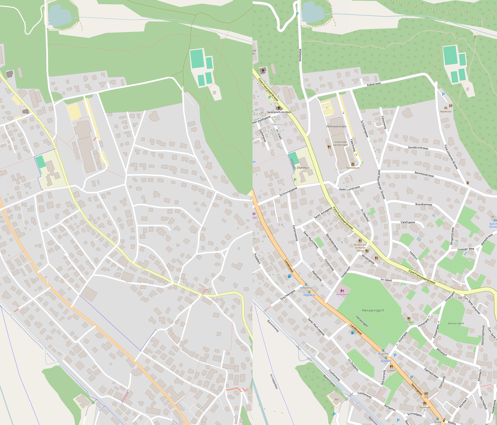

# openstreetmap-mapboxgl

This project uses the [MapboxGL](https://github.com/mapbox/mapbox-gl) library with the tile schema of openstreetmap-carto. A new style has been composed to suit.

The goal of this project isn't to be a 1-to-1 replacement for openstreetmap-carto. However, this project is aimed at making a style similar to openstreetmap-carto using the same tileschema. The focus here is clarity and simplicity without necessarily showing all the attributes that openstreetmap-carto does.

#### If you have an issue with the openstreetmap-carto branch, please raise it here as to avoid confusing the main OSM2VectorTiles issues page.

Left: Mapbox GL, Right: Openstreetmap-carto

All building is using a branch of the OSM2VectorTiles project. The build will be similiar to that pipeline.

To use the following instructions, you will need to have Docker and Docker-compose installed. You may also need to add yourself to the "docker" group to avoid having to run the docker-compose commands under sudo.

## Building:

1. git clone -b openstreetmap-style https://github.com/osm2vectortiles/osm2vectortiles.git
2. cd osm2vectortiles
3. make postgis; make import-osm2pgsql; make generate-tm2source; make export-mbtiles
4. docker-compose up -d postgis
5. Put any PBF extract you'd like into osm2vectortiles/import . Any name is acceptable. I've used small extracts like Liechtenstein from Geofabrik quite successfully
6. docker-compose up import-osm2pgsql
7. docker-compose up generate-tm2source
8. Modify osm2vectortiles/docker-compose.yml and search for the line: "BBOX". Modify this line to the BBOX of your extract. As it is, it is setup for Liechtenstein
9. docker-compose up export
10. Wait 30s, you will have an MBTiles in the osm2vectortiles/export directory

Feel free to import different areas by placing a different PBF into the import directory and modifying the docker-compose.yml BBOX. The export-worker approach for large exports across a cluster should work fine but is currently untested.

## Serving:

This will use the tileserver-gl-light project to serve up the PBF. The actual osm-v1.json style will be hosted with a different webserver however:

1. git clone https://github.com/stirringhalo/docker-tileserver-gl-light.git
2. cd docker-tileserver-gl-light/tileserver-gl-light
3. Place the osm2vectortiles/export/*.mbtiles into docker-tileserver-gl-light/tileserver-gl-light/import/
4. docker build -t tileserver-gl-light .
5. docker run -d -it -p 0.0.0.0:10000:8080 -v $(pwd)/import:/import tileserver-gl-light

